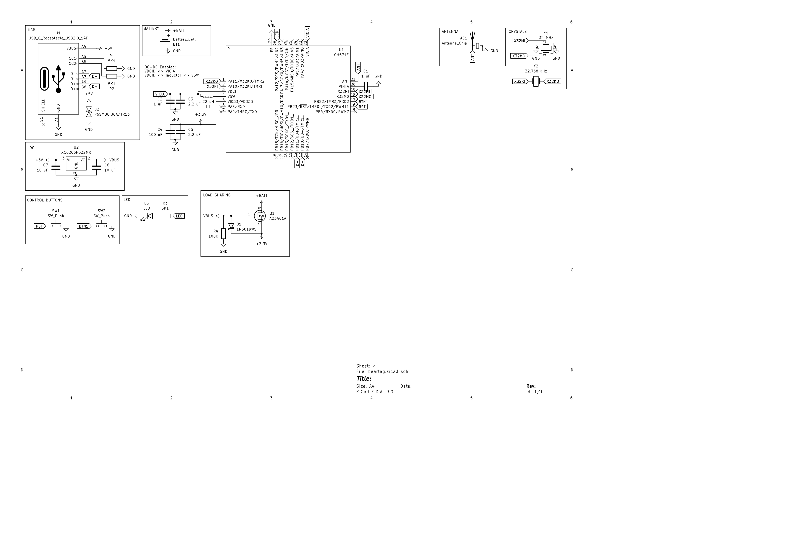
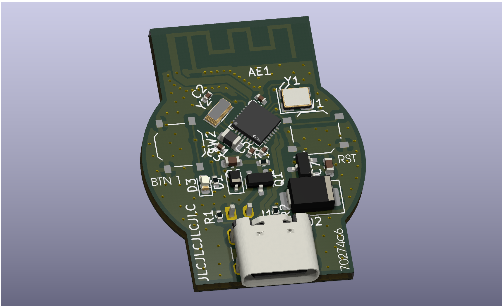

# beartag

A low cost, open source BLE device tracker.

Compatible with [macless-haystack](https://github.com/dchristl/macless-haystack)

## PCB

The board is based on a WCH CH571 MCU. (Low cost BLE mcu)

It can be powered off of a single CR2032 battery, which should last at least a couple months (and potentially as long as a year)

The board includes one customizable button as well as a status LED.

## Firmware

Firmware is coming soon
